# Multimodal Minecraft Schematic Retrieval

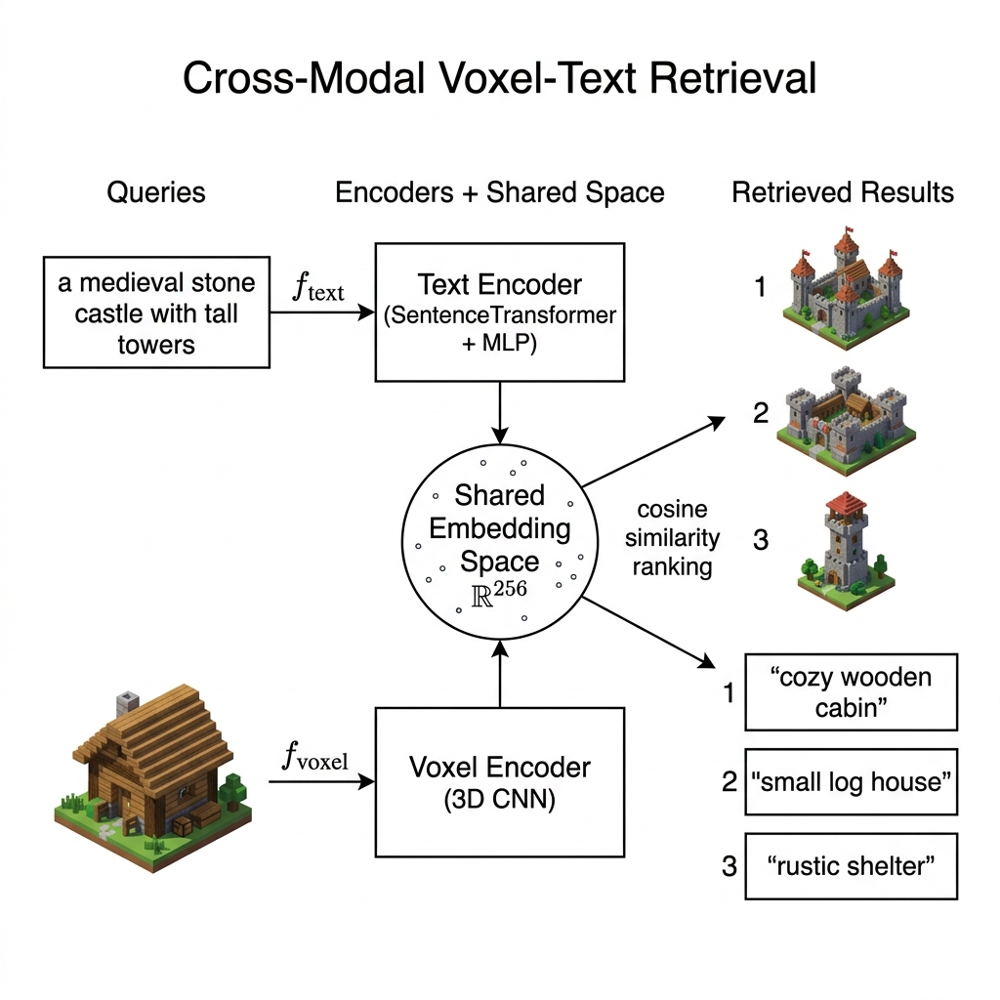

## 1. Introduction

Minecraft is home to one of the largest user-generated 3D content ecosystems in the world. Community platforms like [Planet Minecraft](https://www.planetminecraft.com/) host hundreds of thousands of player-created structures, castles, houses, pixel art, redstone contraptions, entire cities, shared as downloadable **schematics** (3D voxel grids of block IDs). But finding the right schematic is painful: search is keyword-based, tags are inconsistent, and there's no way to search by _structure_ or _vibe_.

This project explores **cross-modal retrieval between natural language and 3D voxel structures** in the Minecraft domain. The idea: learn a shared embedding space where text descriptions ("medieval castle with towers") and 3D block grids live side-by-side, enabling semantic search in both directions.

The approach draws from the CLIP paradigm, a dual-encoder architecture trained with symmetric InfoNCE loss, which is then adapted for a unique setting: discrete voxel grids (not point clouds or meshes), noisy community-authored text (not curated captions), and a relatively small dataset (~8K samples). A two-stage training pipeline first pretrains the voxel encoder via masked voxel modeling (self-supervised), then fine-tunes the full dual-encoder with contrastive learning.

> [!NOTE]
> This document serves as a comprehensive explainer of the project. Covering motivation, prior work, data, use cases, architecture, and training details. The technical sections include generated diagrams and mermaid flowcharts for visual reference.

---

## 2. Prior Works

This section covers relevant prior work in cross-modal retrieval between text and 3D structures, 3D-language alignment, and related domains.

---

### 2a. TriCoLo — Trimodal Contrastive Loss for Text to Shape Retrieval

**Ruan et al., WACV 2024** — [arXiv:2201.07366](https://arxiv.org/abs/2201.07366)

TriCoLo tackles **text-to-3D shape retrieval** using a trimodal contrastive learning approach across text, multi-view images, and 3D voxels. The core insight: using rendered images as a **bridge modality** between text and 3D significantly improves retrieval, because image-text alignment is a more natural and better-studied problem than direct text-3D alignment.

**Architecture:**

- **Text encoder:** Bidirectional GRU
- **3D encoder:** 3D CNN on colored voxels
- **Image encoder:** MVCNN with pretrained ResNet18

**Loss:** A sum of three pairwise InfoNCE losses aligning all modality pairs:

```
L_tri = L(voxel, image) + L(voxel, text) + L(image, text)
```

**Key results (Text2Shape benchmark):**

| Model                        | RR@1       | RR@5       | NDCG@5     |
| ---------------------------- | ---------- | ---------- | ---------- |
| **Tri(I+V) — full trimodal** | **12.11%** | **32.39%** | **22.42%** |
| Bi(V) — text+voxel only      | 8.98%      | 26.76%     | 17.99%     |

**Relevance:** Directly comparable to our setup. TriCoLo also uses voxel-based 3D representations with contrastive alignment, and shows that simple contrastive objectives beat more complex architectures. The trimodal bridge idea is a potential future extension for our system (using rendered images of schematics as an additional modality).

---

### 2b. RI-Mamba — Rotation-Invariant Text-to-Shape Retrieval

**Nguyen et al., 2026** — [arXiv:2602.11673](https://arxiv.org/abs/2602.11673)

RI-Mamba is the **first rotation-invariant architecture based on State-Space Models (Mamba)** for text-to-3D retrieval. It addresses the realistic scenario where 3D objects appear in arbitrary orientations — existing methods assume canonical poses and break down under rotation.

**Key technical components:**

- **Local Reference Frames (LRFs):** Disentangle pose from intrinsic geometry at the input level
- **Hilbert curve serialization:** Converts unordered point cloud patches into a spatially-coherent 1D sequence for Mamba processing
- **FiLM-based orientation reintegration:** Recovers spatial context lost during LRF normalization
- **CLIP-aligned contrastive learning** with automated triplet generation (no manual annotation)

**Key results (OmniObject3D, 214 categories):**

| Method         | mAP (canonical) | mAP (SO(3) rotated) |
| -------------- | --------------- | ------------------- |
| PointBERT-TAMM | 49.84           | ~22                 |
| **RI-Mamba**   | **47.58**       | **47.50**           |

Non-rotation-invariant methods collapse from ~50→22 under rotation. RI-Mamba holds steady at ~47.5.

**Relevance:** Demonstrates state-of-the-art text→3D retrieval with a focus on robustness. The automated triplet generation strategy removes annotation bottlenecks — relevant for scaling our approach. Rotation invariance is less critical for Minecraft schematics (structures are typically axis-aligned), but the Mamba-based 3D encoding is an interesting alternative to our CNN approach.

---

### 2c. Invert3D — Aligning 3D Representations with Text Embeddings

**Song et al., ACM MM 2025** — [arXiv:2508.16932](https://arxiv.org/abs/2508.16932)

Invert3D proposes a **camera-conditioned inversion mechanism** that maps 3D scenes (NeRF / 3D Gaussian Splatting) into CLIP's text-aligned embedding space, enabling language-driven 3D editing without retraining.

**Core mechanism:**

- Renders multiple 2D views of a 3D scene from different camera poses
- Processes views through a camera-conditioned inversion module
- Produces a 3D embedding aligned with CLIP's vision-text space
- Enables latent-space manipulation for text-guided personalization

**Relevance:** While focused on editing/personalization rather than retrieval, the core technique of projecting 3D representations into a pre-aligned text embedding space is conceptually similar to our approach. The key insight — that you can leverage existing vision-language alignment (CLIP) as a bridge — is shared across many works in this space. However, Invert3D operates on continuous neural 3D representations, whereas our system uses discrete voxel grids.

---

### 2d. DreamCraft — Text-Guided 3D Generation in Minecraft

**Earle et al., FDG 2024** — [arXiv:2404.15538](https://arxiv.org/abs/2404.15538)

DreamCraft tackles **text-to-3D generation** (not retrieval) specifically in the Minecraft domain — making it the most domain-relevant prior work despite the different task formulation.

**Approach:**

- Uses a **quantized Neural Radiance Field** that learns to place discrete Minecraft block types during training (not post-hoc)
- Optimized via **Score Distillation Sampling (SDS)** against a frozen text-to-image diffusion model
- Adds **functional constraint losses**: block-type distribution targets and adjacency rules

**Relevance:** DreamCraft is complementary to our retrieval approach. Where we find _existing_ builds matching a description, DreamCraft _generates new_ builds from scratch. Interesting future work could combine both: retrieve the closest existing schematic, then use generation to modify it toward the query. The paper also validates that the Minecraft domain has real demand for text-guided 3D interaction.

> [!TIP]
> DreamCraft uses no contrastive learning or embedding alignment — the text-3D connection is purely through SDS optimization against a diffusion model. This is a fundamentally different paradigm from our retrieval-based approach.

---

### 2e. VXP — Voxel-Cross-Pixel Place Recognition

**Li et al., 3DV 2025** — [arXiv:2403.14594](https://arxiv.org/abs/2403.14594)

VXP addresses **cross-modal place recognition** between 2D camera images and 3D LiDAR point clouds (voxelized). While the application domain (autonomous driving / localization) differs from ours, the technical approach to bridging a large modality gap is highly instructive.

**Multi-stage training strategy:**

1. **Global image pre-training** — learn distinctive 2D descriptors
2. **Local correspondence alignment** — enforce feature similarity between spatially corresponding voxels and pixels via geometric projection
3. **Global descriptor consistency** — align cross-modal global embeddings in a shared space

**Key results (Oxford RobotCar):**

| Direction | Recall@1 | Recall@1% |
| --------- | -------- | --------- |
| 2D → 3D   | 47.16%   | 71.72%    |
| 3D → 2D   | 30.01%   | 56.09%    |

**Relevance:** VXP's key takeaway for our project is that bridging a large modality gap benefits from **local-to-global alignment** rather than just contrasting global descriptors. Their multi-stage training (local features first, then global) parallels our two-stage approach (MVM pretraining for local voxel understanding first, then global contrastive alignment). The voxel-based 3D processing is also architecturally similar to our VoxelEncoder.

---

### Summary of Prior Work Landscape

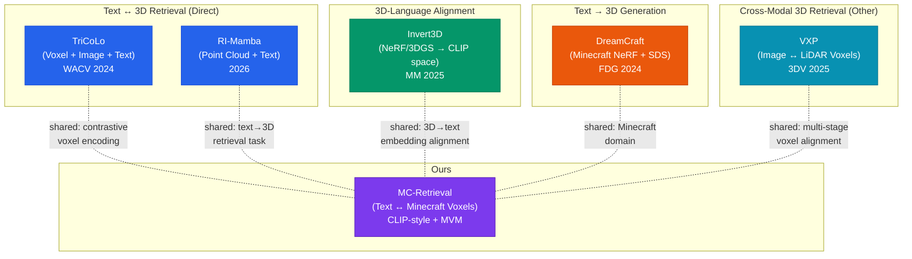

> [!IMPORTANT]
> Our work occupies a unique niche: **text ↔ discrete voxel retrieval in a creative/gaming domain**. Most prior text-3D retrieval work targets clean CAD models (ShapeNet) or real-world scans. Our dataset of noisy, diverse, community-created Minecraft schematics presents distinct challenges — highly variable quality, creative naming conventions, and a discrete block vocabulary — that aren't addressed by existing methods.

---

## 3. Data Source

The dataset powering this system is a collection of **8,328 Minecraft schematics** scraped from [Planet Minecraft](https://www.planetminecraft.com/), one of the largest community hubs for user-created Minecraft content. Each record pairs a 3D voxel structure with rich user-authored metadata.

### What's in the dataset

| Feature                  | Type    | Description                                                            |
| ------------------------ | ------- | ---------------------------------------------------------------------- |
| `voxel_data`             | object  | Flattened 32×32×32 array of Minecraft block IDs — the raw 3D structure |
| `title`                  | object  | User-given name (e.g. "Medieval Castle", "Cozy Treehouse")             |
| `subtitle`               | object  | Short tagline or secondary title                                       |
| `description`            | object  | Free-form HTML description written by the creator                      |
| `tags`                   | object  | Community/creator-assigned category tags (JSON-serialized list)        |
| `img`                    | object  | Thumbnail image URL                                                    |
| `bigImgs`                | object  | Gallery image URLs (JSON-serialized)                                   |
| `user`                   | object  | Creator username                                                       |
| `date`                   | object  | Upload date                                                            |
| `diamondCount`           | int64   | Community "diamond" upvotes                                            |
| `views`                  | int64   | View count                                                             |
| `downloads`              | int64   | Download count                                                         |
| `comments`               | float64 | Number of comments                                                     |
| `favorites`              | int64   | Favorite count                                                         |
| `url`                    | object  | Original Planet Minecraft page URL                                     |
| `downloadLink`           | object  | Primary download link                                                  |
| `finalDownloadLink`      | object  | Resolved download link                                                 |
| `thirdPartyDownloadLink` | object  | External mirror link                                                   |
| `youtubeId`              | object  | Associated YouTube showcase video ID                                   |

- **Format:** Apache Parquet (`data.parquet`, ~11 MB)
- **Origin:** Originally collected by Romain Beaumont's [minecraft-schematics-dataset](https://github.com/rom1504/minecraft-schematics-dataset) project, reformatted into parquet for ease of use.

### How the text modality is constructed

The text input for each sample is assembled by concatenating four metadata fields:

```
title + subtitle + description (HTML-stripped) + tags
```

This produces a natural-language-ish description that captures the creator's intent, structural details, and categorical context, all without requiring any manual annotation.

### Voxel representation

Each schematic is stored as a flat array of block IDs representing a 32³ voxel grid. During preprocessing, the top-254 most frequent block types are kept (mapped to IDs 2–255), with `0 = air` and `1 = rare/other`. The grid is bounding-box cropped to the non-air region, then nearest-neighbor resized back to 32³.

> [!NOTE]
> The dataset is entirely **community-generated**. Structures range from tiny furniture pieces to sprawling castles, with highly variable quality, style, and complexity. This makes it a challenging but realistic benchmark for cross-modal retrieval.

---

## 4. Use Cases

### 4a. Text-to-Build Search

> _"I want a medieval castle with towers and a moat"_

The most straightforward application: a player types a natural language description and the system retrieves the most similar schematics from the database, ranked by cosine similarity. This replaces the current keyword-based search on platforms like Planet Minecraft, which struggles with semantic queries (e.g. "cozy" or "futuristic" don't map to specific block types).

### 4b. Build-to-Text Discovery (Reverse Search)

Given a voxel structure (e.g. one you just built), retrieve the closest text descriptions, essentially asking _"what does this look like?"_ or _"what would someone call this?"_. Useful for:

- Auto-generating titles/tags for uploads
- Finding similar existing builds to compare against
- Content moderation (detecting copies or near-duplicates)

### 4c. Recommendation & Similarity Browsing

Since both modalities live in the same embedding space, you can use voxel→voxel similarity to power a **"more like this"** recommendation system. A user clicks on a build they like, and the system finds structurally similar ones without relying on tags or metadata at all.

### 4d. Content Organization & Clustering

The learned embeddings can be used to **automatically cluster** the schematic database into semantic groups (castles, houses, vehicles, pixel art, redstone machines, etc.) without manual labeling. This enables:

- Better browse/filter UIs for schematic repositories
- Automatic category assignment for new uploads
- Dataset curation and quality filtering

### 4e. Creative Assistance & Inspiration

Builders looking for inspiration can describe a vague concept and get back real examples that match the vibe. Unlike generation-based approaches (which create _new_ structures), retrieval surfaces _existing_ community creations, often with download links, tutorials, and creator commentary attached.

### 4f. Integration with Minecraft Modding Tools

The retrieval system could be embedded into:

- **WorldEdit / Litematica plugins** — search and paste schematics from within the game
- **Web-based schematic browsers** — semantic search API for community platforms
- **Educational tools** — find example builds for teaching architectural or engineering concepts in Minecraft

---

## 5. High-Level Concept


The core idea: learn a **shared embedding space** where text descriptions and 3D voxel structures live side-by-side, enabling cross-modal search in both directions.

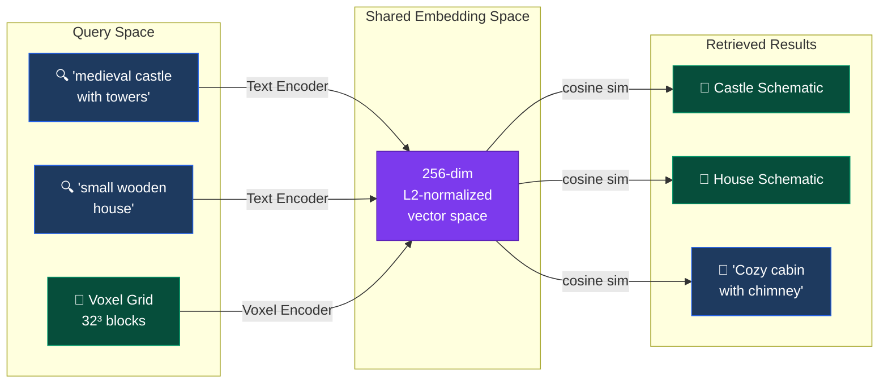

> [!NOTE]
> The system supports **bidirectional retrieval**: Text→Voxel (find structures from descriptions) and Voxel→Text (find descriptions for structures).

---

## 6. Full System Flowchart

End-to-end pipeline from raw data to retrieval results.

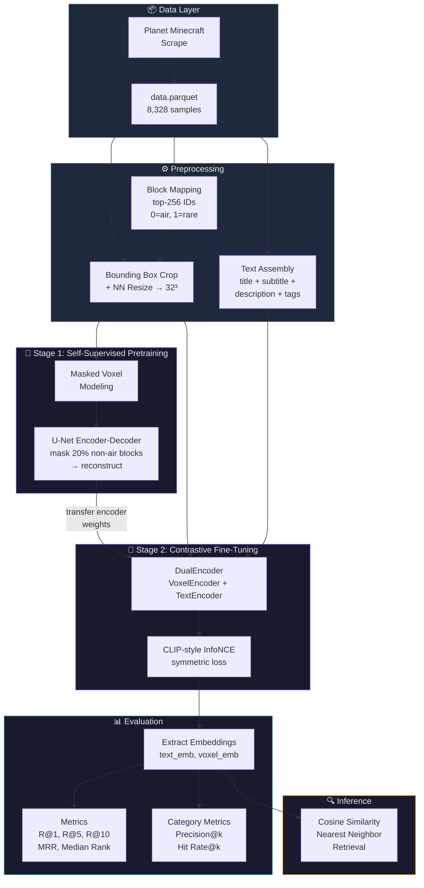

---

## 7. Model Architecture


### 7a. DualEncoder — Top-Level

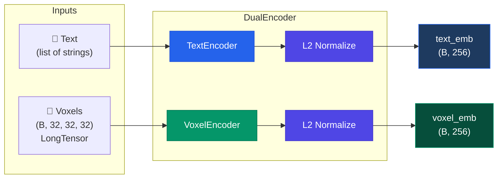

---

### 7b. VoxelEncoder — 3D CNN Pipeline

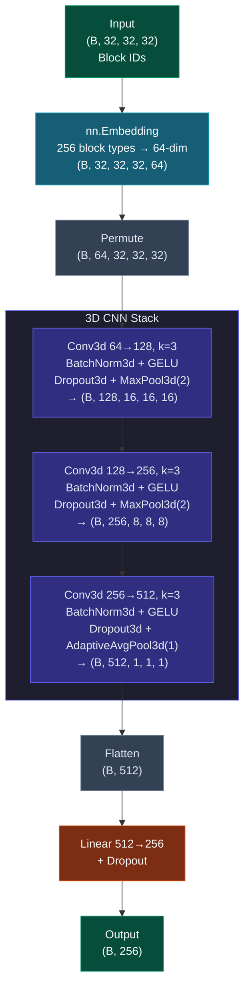

---

### 7c. TextEncoder — Frozen Backbone + Learned Projection

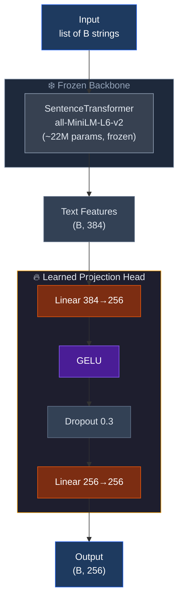

---

## 8. Training Mechanism

### 8a. Stage 1 — Masked Voxel Modeling (Self-Supervised Pretraining)


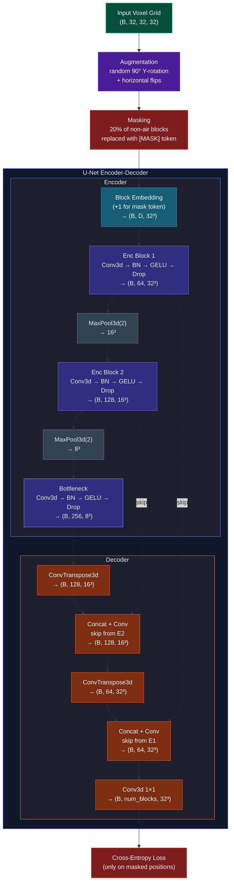

> [!IMPORTANT]
> After MVM pretraining, the **encoder weights are extracted** using `get_encoder_state_dict()` and transferred to the VoxelEncoder in the DualEncoder. The decoder is discarded.

---

### 8b. Stage 2 — CLIP-Style Contrastive Fine-Tuning


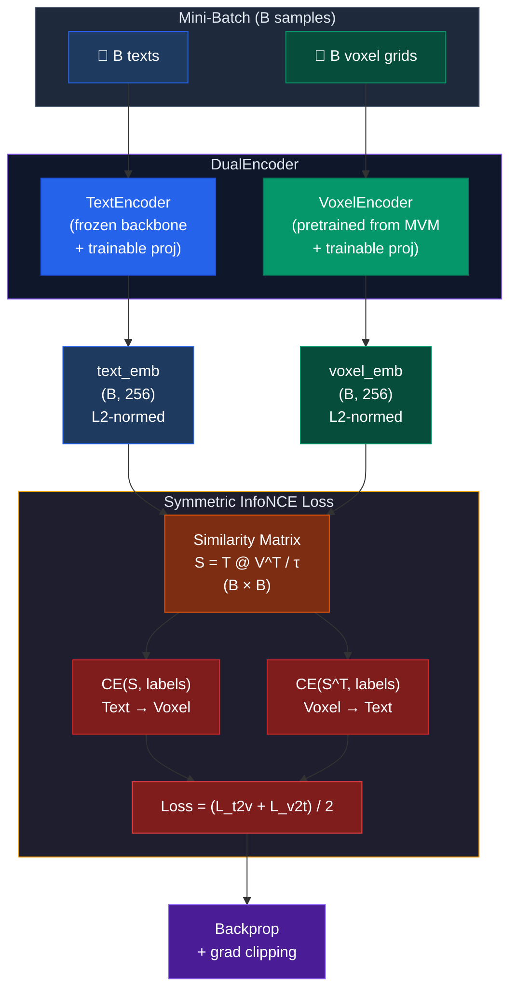

#### The Similarity Matrix

```
              Voxel₁  Voxel₂  Voxel₃  ...  VoxelB
    Text₁  │  ✓ 0.92   0.11    0.05         0.03  │
    Text₂  │    0.08  ✓ 0.89   0.12         0.07  │
    Text₃  │    0.04    0.06  ✓ 0.87         0.10  │
     ...   │    ...     ...     ...          ...   │
    TextB  │    0.02    0.05    0.03       ✓ 0.91  │

    ✓ = diagonal = ground-truth match (labels = [0, 1, 2, ..., B-1])
    τ = learnable temperature, clamped to [0.01, 1.0]
```

---

### 8c. Two-Stage Training Overview


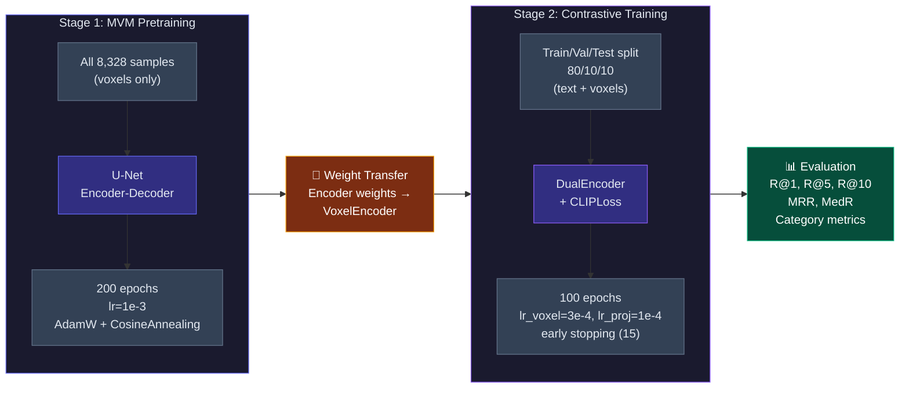

---

## 9. Data Preprocessing Pipeline

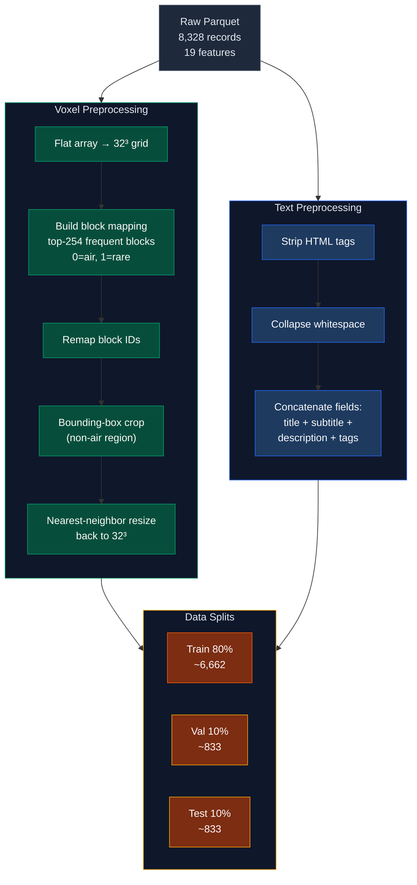

---

## 10. Key Hyperparameters Summary

| Component                | Parameter        | Value            |
| ------------------------ | ---------------- | ---------------- |
| **Embedding Space**      | Dimension        | 256              |
| **VoxelEncoder**         | Block embed dim  | 32               |
|                          | CNN channels     | [64, 128, 256]   |
|                          | Dropout          | 0.3              |
| **TextEncoder**          | Backbone         | all-MiniLM-L6-v2 |
|                          | Hidden dim       | 384              |
|                          | Backbone frozen  | ✓                |
| **MVM Pretraining**      | Mask ratio       | 20%              |
|                          | Epochs           | 200              |
|                          | Learning rate    | 1e-3             |
|                          | Batch size       | 256              |
| **Contrastive Training** | Epochs           | 100              |
|                          | LR (voxel)       | 3e-4             |
|                          | LR (text proj)   | 1e-4             |
|                          | Temperature init | 0.07 (learnable) |
|                          | Early stopping   | 15 epochs        |
|                          | Batch size       | 256              |
| **Data**                 | Samples          | 8,328            |
|                          | Block vocab      | 256              |
|                          | Voxel grid       | 32³              |
|                          | Splits           | 80/10/10         |
