# Multimodal Minecraft Schematic Retrieval — Diagrams & Figures

---

## 1. High-Level Concept

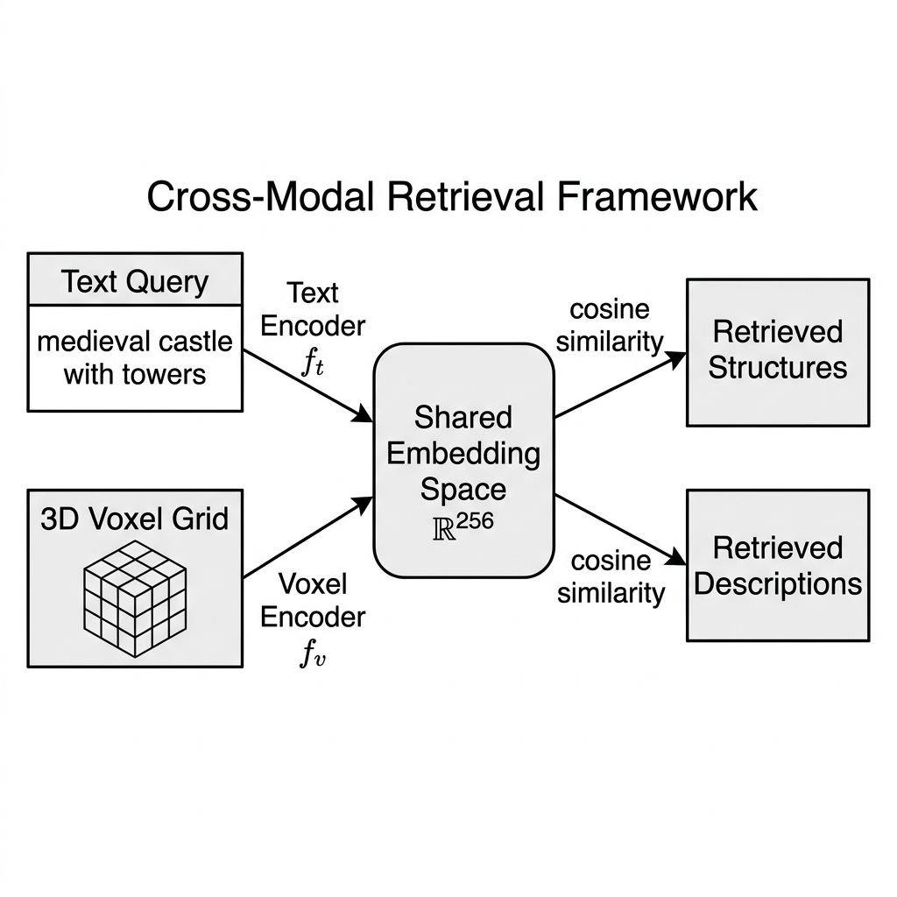

The core idea: learn a **shared embedding space** where text descriptions and 3D voxel structures live side-by-side — enabling cross-modal search in both directions.

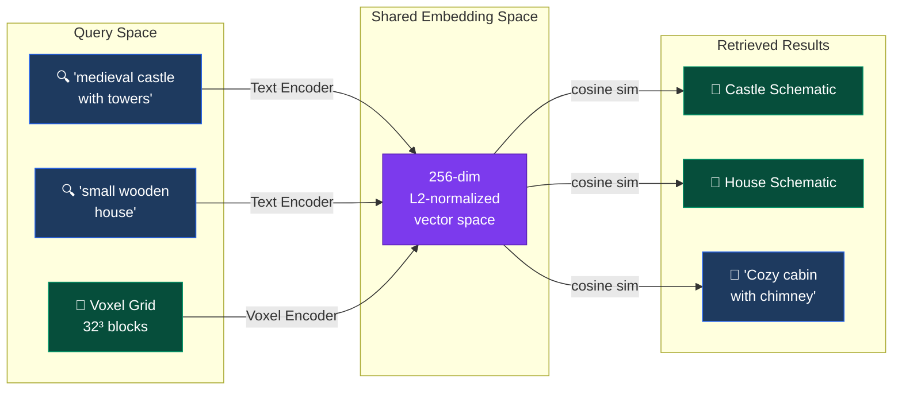

> [!NOTE]
> The system supports **bidirectional retrieval**: Text→Voxel (find structures from descriptions) and Voxel→Text (find descriptions for structures).

---

## 2. Full System Flowchart

End-to-end pipeline from raw data to retrieval results.

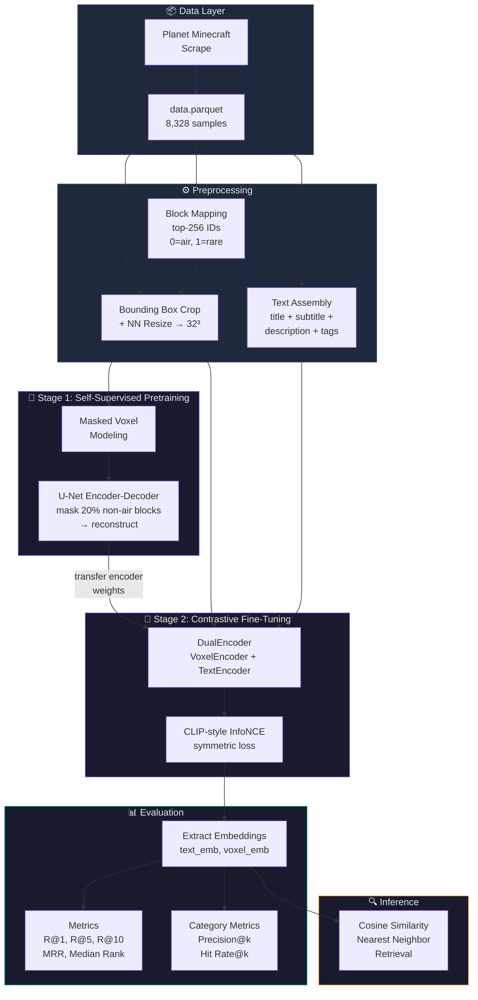

---

## 3. Model Architecture

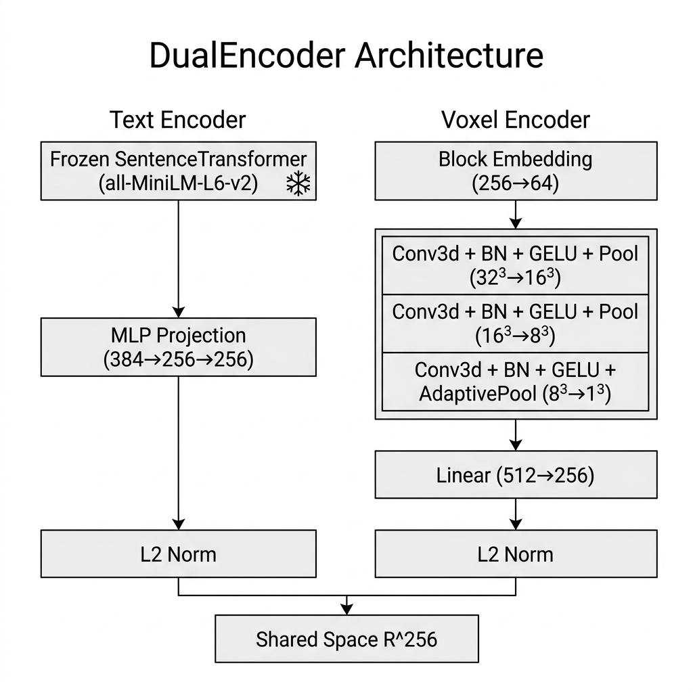

### 3a. DualEncoder — Top-Level

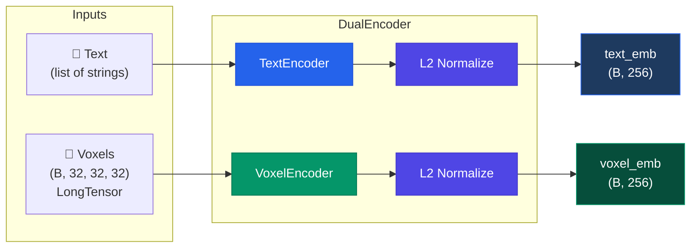

---

### 3b. VoxelEncoder — 3D CNN Pipeline

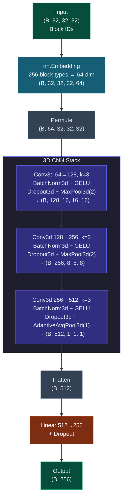

---

### 3c. TextEncoder — Frozen Backbone + Learned Projection

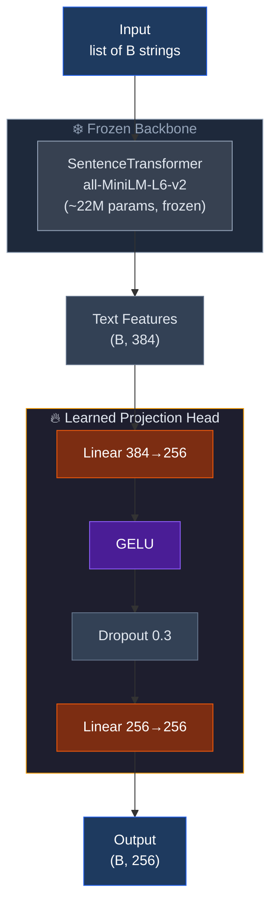

---

## 4. Training Mechanism

### 4a. Stage 1 — Masked Voxel Modeling (Self-Supervised Pretraining)

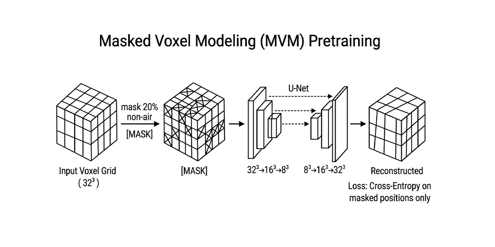

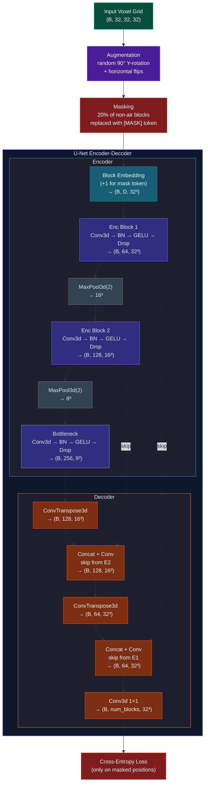

> [!IMPORTANT]
> After MVM pretraining, the **encoder weights are extracted** using `get_encoder_state_dict()` and transferred to the VoxelEncoder in the DualEncoder. The decoder is discarded.

---

### 4b. Stage 2 — CLIP-Style Contrastive Fine-Tuning

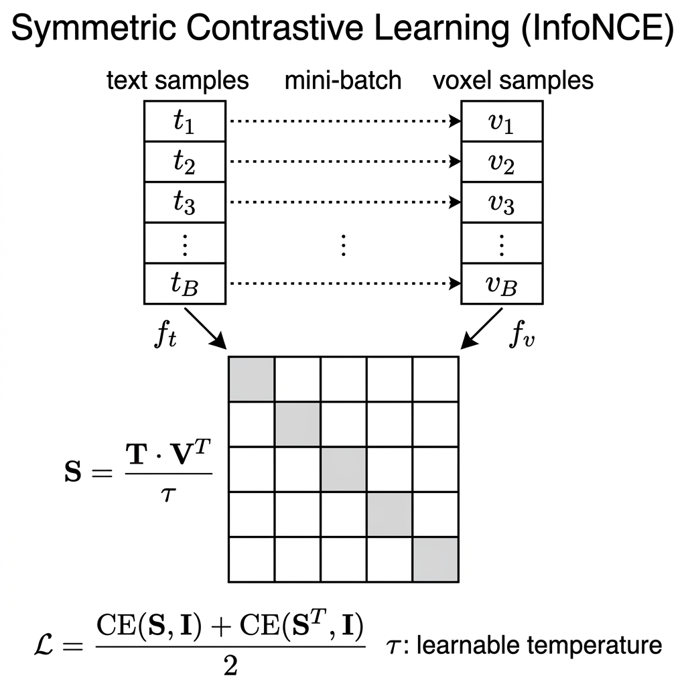

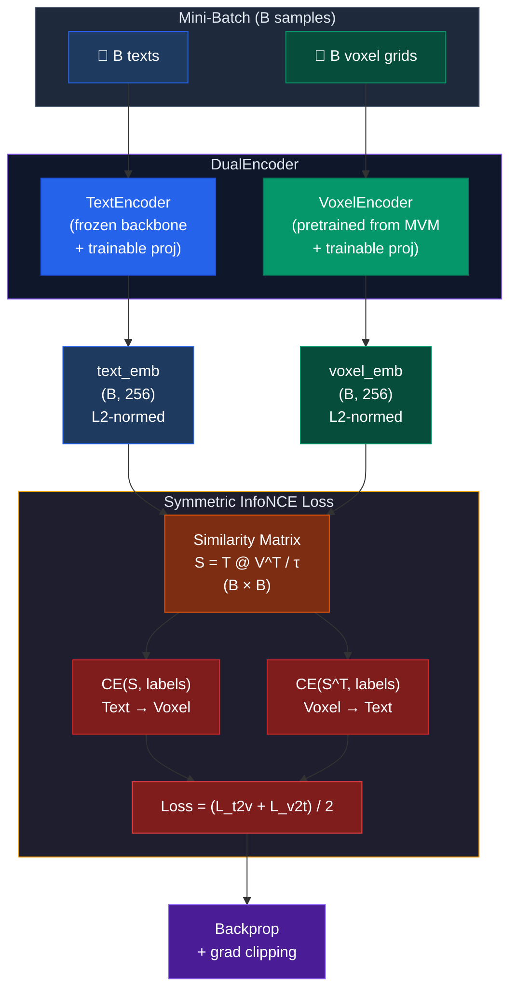

#### The Similarity Matrix

```
              Voxel₁  Voxel₂  Voxel₃  ...  VoxelB
    Text₁  │  ✓ 0.92   0.11    0.05         0.03  │
    Text₂  │    0.08  ✓ 0.89   0.12         0.07  │
    Text₃  │    0.04    0.06  ✓ 0.87         0.10  │
     ...   │    ...     ...     ...          ...   │
    TextB  │    0.02    0.05    0.03       ✓ 0.91  │

    ✓ = diagonal = ground-truth match (labels = [0, 1, 2, ..., B-1])
    τ = learnable temperature, clamped to [0.01, 1.0]
```

---

### 4c. Two-Stage Training Overview

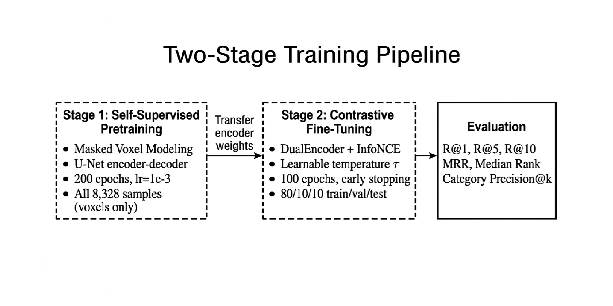

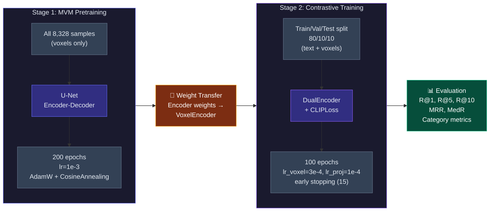

---

## 5. Data Preprocessing Pipeline

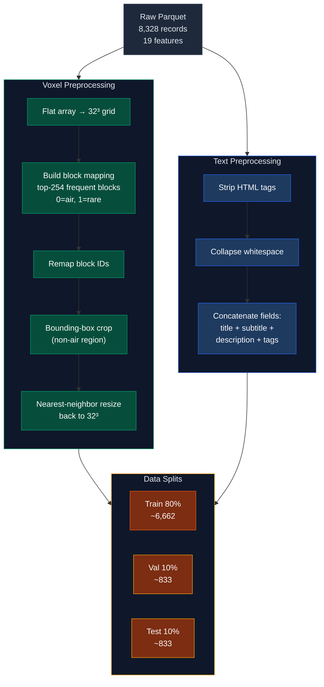

---

## 6. Key Hyperparameters Summary

| Component                | Parameter        | Value            |
| ------------------------ | ---------------- | ---------------- |
| **Embedding Space**      | Dimension        | 256              |
| **VoxelEncoder**         | Block embed dim  | 32               |
|                          | CNN channels     | [64, 128, 256]   |
|                          | Dropout          | 0.3              |
| **TextEncoder**          | Backbone         | all-MiniLM-L6-v2 |
|                          | Hidden dim       | 384              |
|                          | Backbone frozen  | ✓                |
| **MVM Pretraining**      | Mask ratio       | 20%              |
|                          | Epochs           | 200              |
|                          | Learning rate    | 1e-3             |
|                          | Batch size       | 256              |
| **Contrastive Training** | Epochs           | 100              |
|                          | LR (voxel)       | 3e-4             |
|                          | LR (text proj)   | 1e-4             |
|                          | Temperature init | 0.07 (learnable) |
|                          | Early stopping   | 15 epochs        |
|                          | Batch size       | 256              |
| **Data**                 | Samples          | 8,328            |
|                          | Block vocab      | 256              |
|                          | Voxel grid       | 32³              |
|                          | Splits           | 80/10/10         |
